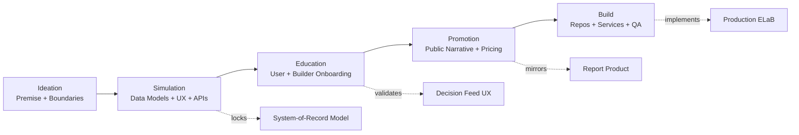

AiD Fit for ELaB

```mermaid
flowchart LR
  I[Ideation<br/>Premise + Boundaries] --> S[Simulation<br/>Data Models + UX + APIs]
  S --> E[Education<br/>User + Builder Onboarding]
  E --> P[Promotion<br/>Public Narrative + Pricing]
  P --> B[Build<br/>Repos + Services + QA]

  S -.locks.-> DB[System-of-Record Model]
  E -.validates.-> UX[Decision Feed UX]
  P -.mirrors.-> R[Report Product]
  B -.implements.-> SYS[Production ELaB]
```

AiD requires simulation artifacts before build, with API/data models, unknowns, and behavior locked before implementation.