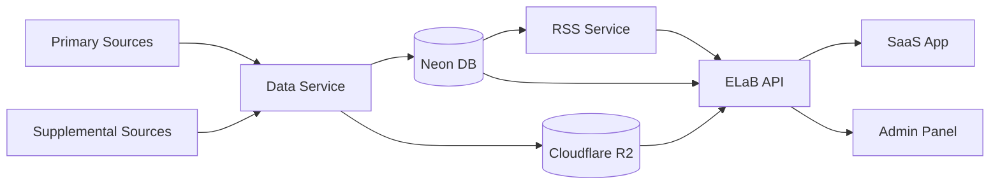
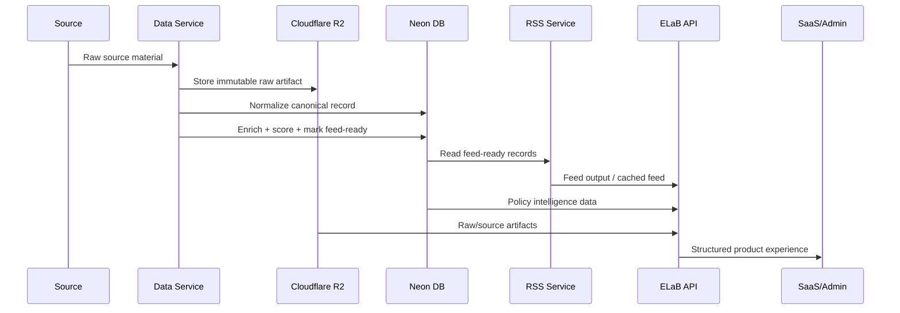

# ELaB Architecture 



## Service Boundary

### 1. Data Service

Owns ingestion, normalization, enrichment, and persistence.

Responsibilities:

- ingest primary + supplemental sources
    
- store raw artifacts in Cloudflare R2
    
- normalize records into Neon
    
- run LLM extraction/enrichment inline or scheduled
    
- produce canonical policy intelligence objects
    
- mark records as feed-ready
    

This becomes the **source-of-truth engine**, not just ingestion.

---

### 2. Neon DB

Stores:

- normalized policy records
    
- actor entities
    
- funding flows
    
- constraints
    
- time horizons
    
- enrichment status
    
- feed eligibility
    

---

### 3. Cloudflare R2

Stores:

- raw PDFs
    
- raw HTML snapshots
    
- source extracts
    
- generated report artifacts, if needed
    

---

### 4. RSS Service

Owns distribution formatting only.

Responsibilities:

- read feed-ready records from Neon
    
- generate topic feeds
    
- deduplicate feed entries
    
- cache RSS output
    

Constraint:

> RSS Service does not enrich, score, or interpret.

---

### 5. ELaB API

Owns product access.

Responsibilities:

- expose policy records
    
- expose feed entries
    
- support SaaS app interaction
    
- provide AI chat / advisory endpoints
    
- query Neon + R2
    

Constraint:

> API does not mutate canonical policy truth except user-layer artifacts.

---

### 6. SaaS App + Admin

SaaS App:

- social-feed interaction
    
- @role AI advisory
    
- threads
    
- saved reports
    

Admin:

- source monitoring
    
- ingestion status
    
- record inspection
    
- manual correction workflow
    

---

## Data Flow



## Repo Layout

```text
elab-data-service
elab-api
elab-rss-service
elab-app
```
## Rule

> Data Service owns truth production.  
> RSS Service owns syndication.  
> API owns access.  
> App owns interaction.

