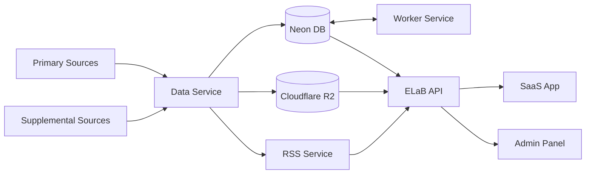
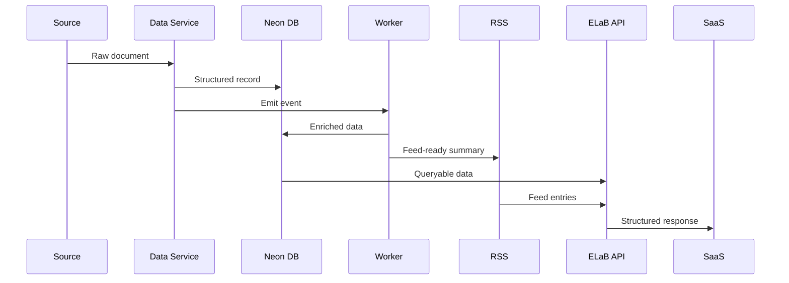

# ELaB — System Architecture (Simulation Artifact)

## 0. Premise (Locked)

ELaB is a **policy-to-intelligence pipeline** that ingests institutional signals, normalizes them into structured data, and distributes decision-ready outputs via API, feed, and AI interface.

System priority:

> **Speed of interpretation > speed of ingestion > speed of display**

---

## 1. System Topology



---

## 2. Core System Boundary

### INCLUDED

- Policy ingestion (federal + supplemental)
    
- Data normalization + storage
    
- Derived intelligence generation
    
- Feed distribution (RSS + API)
    
- Human + AI interaction layer
    

### EXCLUDED

- Raw scraping UI
    
- Manual research workflows
    
- External analytics tooling
    

---

## 3. Services (Atomic Definition)

---

## 3.1 Data Service (Source of Truth Layer)

**Role:** Analyst + Builder

### Responsibilities

- Ingest raw documents (HTML, PDF, feeds)
    
- Normalize into canonical schema
    
- Assign IDs + versioning
    
- Emit structured events
    

### Inputs

- congress.gov, federalregister.gov, etc.
    
- supplemental (OpenSecrets, news)
    

### Outputs

- structured records → Neon DB
    
- raw artifacts → Cloudflare R2
    
- event stream → Worker Service
    

### Constraints

- idempotent ingestion required
    
- no downstream formatting logic
    
- schema must be forward-compatible
    

---

## 3.2 Storage Layer

### Neon DB (Relational truth)

Stores:

- bills, amendments, actors
    
- funding flows
    
- relationships (normalized graph edges)
    

### Cloudflare R2 (Object storage)

Stores:

- PDFs
    
- raw HTML snapshots
    
- derived artifacts (reports, embeddings optional)
    

---

## 3.3 Worker Service (Computation Layer)

**Role:** Operator

### Responsibilities

- enrichment jobs
    
- LLM processing (OpenAI / DeepSeek)
    
- entity extraction
    
- relationship mapping
    
- report generation
    

### Trigger Types

- new record
    
- record update
    
- scheduled recompute
    

### Outputs

- enriched DB records
    
- generated artifacts
    
- feed-ready summaries
    

### Constraint

> Worker cannot define schema or truth—only transform it

---

## 3.4 RSS Service (Distribution Layer)

**Role:** Operator

### Responsibilities

- convert DB records → feed entries
    
- topic-based feed segmentation
    
- cache + delivery optimization
    

### Outputs

- RSS endpoints
    
- webhook-style updates (optional)
    

---

## 3.5 ELaB API (Interface Layer)

**Role:** Builder

### Responsibilities

- unified access layer
    
- query + filtering
    
- AI interaction endpoint
    
- feed aggregation
    

### Interfaces

- REST / GraphQL (choose one, don’t hedge)
    
- streaming endpoint (for feed UX)
    

### Constraint

> API reflects system truth; it does not compute it

---

## 3.6 SaaS App (User Interface)

**Role:** Builder

### Responsibilities

- decision feed UX (not dashboard)
    
- thread-based interaction
    
- role-based AI responses
    
- artifact display (structured, not blobs)
    

### Core Interaction Model

- post → system responds via role
    
- @role targeting
    
- feed = primary interface
    

---

## 3.7 Admin Panel

**Role:** Operator

### Responsibilities

- ingestion monitoring
    
- job inspection
    
- manual overrides (rare, logged)
    
- schema inspection
    

---

## 4. Data Flow (Canonical)



---

## 5. Data Model (Minimum Viable Schema)

### Core Objects

#### Policy Object

- id
    
- title
    
- summary
    
- status (introduced, amended, enacted)
    
- dates
    

#### Actor Object

- legislators
    
- lobbyists
    
- orgs
    

#### Funding Flow Object

```
source → mechanism → destination → amount → conditions
```

#### Industry Impact Object

- industry
    
- expected effect
    
- time horizon
    

#### Relationship Edges

- policy ↔ actor
    
- policy ↔ funding
    
- policy ↔ industry
    

---

## 6. System Invariants (Non-Negotiable)

1. **Single source of truth = Neon DB**
    
2. **Raw data is never mutated**
    
3. **Derived data is always reproducible**
    
4. **Workers are stateless**
    
5. **API is read-only relative to truth**
    
6. **UI never computes meaning**
    

Violation = system drift → triggers failure under AiD rules

---

## 7. Failure Modes (Predefined)

### 1. Ingestion Drift

- cause: source structure change
    
- mitigation: schema validation + alerts
    

### 2. LLM Hallucination

- cause: weak grounding
    
- mitigation:
    
    - strict input scoping
        
    - citation requirement
        
    - diff-based updates only
        

### 3. Feed Pollution

- cause: low-signal updates
    
- mitigation:
    
    - scoring threshold
        
    - deduplication
        

### 4. Schema Breakage

- cause: uncontrolled evolution
    
- mitigation:
    
    - versioned migrations only
        

---

## 8. Deployment Topology

- **Railway** → services (API, workers)
    
- **Neon** → DB
    
- **Cloudflare R2** → storage
    
- **Queue** → (add: Upstash / RabbitMQ)
    

---

## 9. What’s Missing (You haven’t decided yet)

Answer these or you’ll hit SITD:

1. **Event system**: Kafka vs queue vs DB triggers?
    
2. **API type**: REST or GraphQL? Pick one.
    
3. **LLM boundary**: per-record vs batch processing?
    
4. **Scoring model**: what determines feed priority?
    
5. **Schema authority**: who can change it?
    

If these remain open → you are still in Simulation, not Build

---

## 10. Hard Assessment

What you drew is directionally correct.  
What was missing:

- explicit system boundaries
    
- role separation
    
- invariants
    
- failure definitions
    

Without those, this becomes **SITD with nicer diagrams**.

---

## Next Step (don’t skip)

You need one of these, immediately:

- API contract (real endpoints + payloads)
    
- DB schema (tables + relationships)
    
- Feed scoring model
    

Pick one.