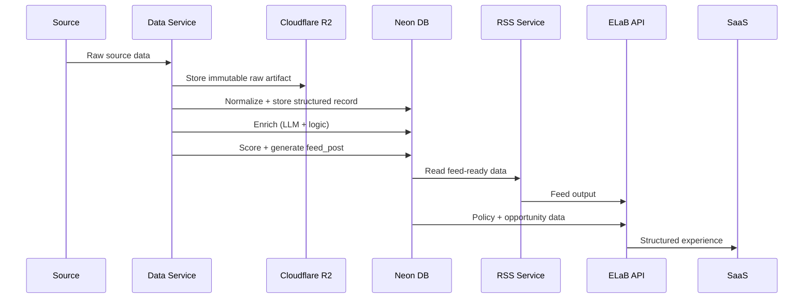

# ELaB Application Architecture

Architecture is **multi-app / multi-service**.

---

## ELaB Application Split

```txt
1. ELaB SaaS & Admin Console App
   User-facing interaction layer

2. ELaB API
   Access + orchestration layer

3. ELaB Data Service
   Source-of-truth + intelligence production

4. ELaB RSS Service
   Distribution/subscription layer
```

---

## System Flow

```txt
Primary Sources
  congress.gov
  federalregister.gov
  grants.gov
  usaspending.gov
  FEC / OpenFEC
        ↓
ELaB Data Service
  fetch → normalize → dedupe → enrich → score → store
        ↓
ELaB Datastore
  Neon Postgres = structured truth
  Cloudflare R2 = raw documents / snapshots / artifacts
        ↓
RSS Service
  generated feeds
  subscriber-specific feeds
  public digest feeds
        ↓
ELaB API
        ↓
SaaS App
  feed UI
  role threads
  opportunity pages
  alerts
```

Key shift:

> **Interpretation happens inside Data Service. Not in a separate worker.**

---

## Repo Structure (Updated)

```txt
github/
  elab-app
  elab-api
  elab-data-service
  elab-rss-service
```

---

## 1. `elab-app`

**Owns:** user + admin interface only.

```txt
- Decision Feed UI (social-first, not dashboard)
- @Role / @Team interactions
- opportunity pages
- execution paths
- alerts + subscriptions
- account / billing
```

Constraints:

```txt
- never fetch external sources
- never compute policy meaning
- reads only from API
```

---

## 2. `elab-api`

**Owns:** access layer.

```txt
- auth + org/user scoping
- feed endpoints
- policy endpoints
- opportunity endpoints
- interaction endpoints
- alert endpoints
- billing webhooks
```

Constraints:

```txt
- no ingestion
- no enrichment
- no LLM execution
```

It exposes—not creates—truth.

---

## 3. `elab-data-service` (Critical Change)

**Owns BOTH:**

- ingestion
    
- intelligence production
    

This replaces the Worker Service entirely.

---

### Responsibilities

```txt
INGESTION
- fetch primary + supplemental sources
- normalize records
- dedupe + version
- store raw snapshots in R2
- store structured records in Neon

INTELLIGENCE
- run Synthetic Team logic inline or scheduled
- policy → market translation
- opportunity extraction
- funding flow mapping
- constraint identification
- time horizon modeling
- confidence scoring
- generate feed-ready objects
```

---

### Internal Execution Model

No external worker service. Instead:

```txt
- async job queue (BullMQ / equivalent)
- cron triggers
- event-driven processing (DB insert/update hooks)
```

This keeps compute **internal but asynchronous**.

---

### Storage

```txt
Neon:
  source_records
  policy_items
  policy_versions
  actors
  funding_flows
  opportunities
  constraints
  time_horizons
  confidence_scores
  feed_posts

Cloudflare R2:
  raw API responses
  PDFs
  HTML snapshots
  generated artifacts
```

---

### Hard Constraint

> Data Service defines system truth. Everything else reads it.

---

## 4. `elab-rss-service`

**Owns:** distribution only.

---

### Responsibilities

```txt
- convert feed_posts → RSS items
- generate segmented feeds
- deduplicate entries
- cache feed responses
```

---

### Feed Types

```txt
/public/rss/policies
/public/rss/opportunities
/public/rss/verticals/:vertical
/public/rss/agencies/:agency
/private/rss/users/:token
/private/rss/orgs/:token
```

---

### Constraint

```txt
- no enrichment
- no scoring
- no interpretation
```

---

## Updated Data Flow



---

## Deployment Model (Updated)

```txt
Railway Project: elab-prod

Services:
  api-service
  data-service
  rss-service
  saas-web
  admin-web
  redis (for internal jobs)

NO worker-service
```

External:

```txt
Neon Postgres
Cloudflare R2
OpenAI / DeepSeek
Stripe
Resend
Sentry
```

---

## What You Gained

### 1. Fewer failure points

No queue-service split failures.

### 2. Clear ownership

- Data = truth + intelligence
    
- API = access
    
- RSS = distribution
    
- App = interaction
    

### 3. Faster iteration

No cross-service coordination for core logic.

---

## What You Gave Up (Be honest)

You lose:

- independent scaling of compute
    
- isolation of LLM workloads
    
- clean retry orchestration at scale
    

You only need those when:

```txt
- ingestion volume explodes
- LLM cost/latency dominates
- jobs exceed request lifecycle limits
```

Not now.

---

## Hard Rule (Updated)

```txt
Data Service:
  owns truth + interpretation

RSS Service:
  owns distribution

API:
  owns access

App:
  owns experience
```

Break this and the system collapses into hidden coupling.

---

## Final Check (AiD Compliance)

If you cannot answer these immediately, you’re still pre-simulation:

- What triggers enrichment? (event vs cron)
    
- When is a record “feed-ready”?
    
- How is confidence scored?
    
- What invalidates a previous interpretation?
    

Unanswered = latent SITD risk

---

If you want the next step, don’t expand architecture.

Pick one:

- DB schema (tables + relationships)
    
- API contract (real endpoints + payloads)
    
- feed scoring model
    

That’s where this either becomes real—or collapses.