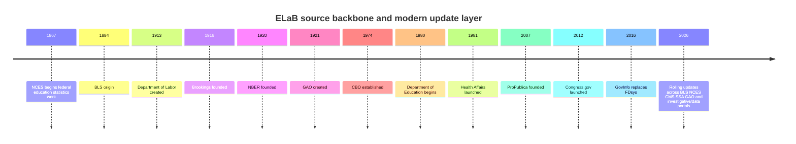
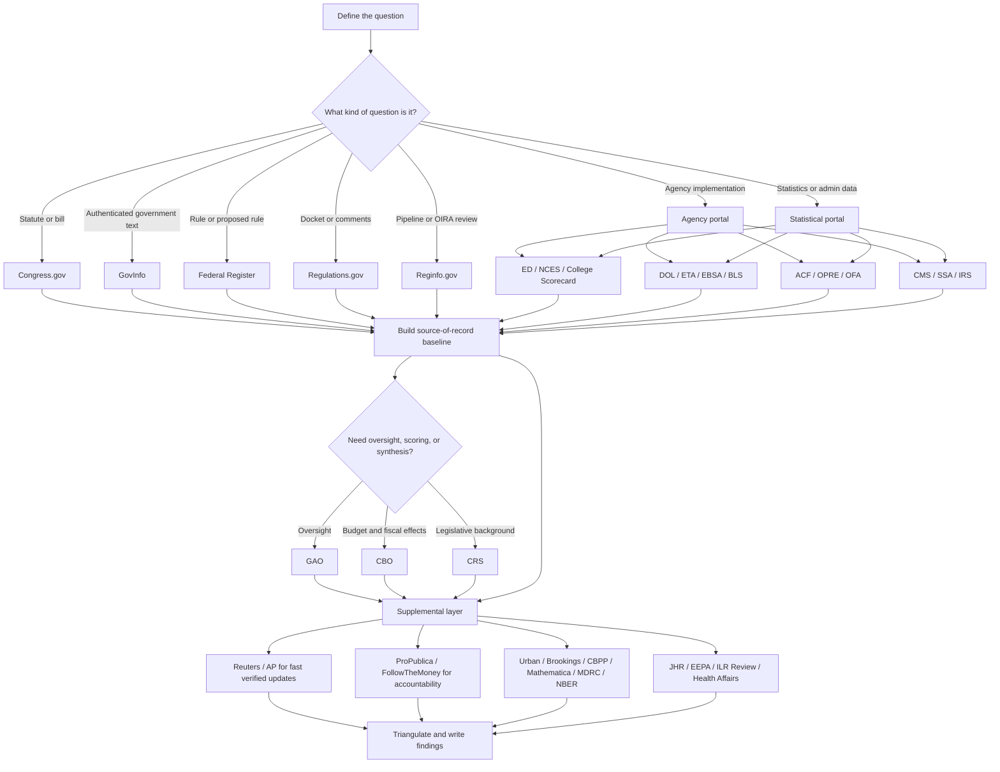

# ELaB Source Directory for Education Labor and Benefits Policy

## Executive summary

For research on education, labor, and benefits policy, the highest-confidence workflow is to start with official sources in a strict order: legislation and authenticated government publications first, rulemaking records second, agency implementation materials and administrative data third, and only then trusted supplemental reporting and analysis. In practice, that means starting with Congress.gov, GovInfo, the Federal Register, Regulations.gov, and Reginfo, then moving into agency and statistical portals such as ED, NCES, BLS, ACF/OPRE, CMS, SSA, IRS, GAO, CBO, and CRS. That sequence preserves provenance, dates, statutory authority, and the administrative paper trail that secondary commentary often compresses or distorts. citeturn22search1turn22search17turn21search13turn21search2turn0search3turn8search28turn8search1

The most useful supplemental layer does three things official sources usually do badly: it surfaces buried controversies, compares institutions across silos, and translates dense documents into policy consequences. For those jobs, the strongest mix is Reuters and AP for fast, standards-driven updates; ProPublica and money-in-politics portals for accountability and structured transparency data; Urban, Brookings, CBPP, Mathematica, MDRC, and NBER for policy analysis and empirical framing; and peer-reviewed journals for causal and design-level evidence. Used properly, supplemental sources do not replace the official record; they help you find, interpret, and pressure-test it. citeturn15search0turn38search5turn10search2turn39search3turn39search2turn11search11turn13search0turn12search4turn12search2

This report assumes **ELaB** means **education, labor, and benefits policy**, as requested. The prompt referred to user-supplied primary URLs, but those URLs were not visible in the accessible thread state for this run; accordingly, the directory below reconstructs the canonical federal source stack from official U.S. domains and then adds a curated supplemental layer.

## Scope and method

The directory below prioritizes sources by four criteria: authority over the underlying record, breadth across ELaB topics, documentation quality, and practical searchability. In blunt terms, if a source can create legal effect, publish an authenticated government text, issue binding or quasi-binding guidance, or release official administrative data, it belongs in the primary tier. If it interprets, investigates, models, or critiques those materials, it belongs in the supplemental tier. That is why Congress.gov, GovInfo, Federal Register, Regulations.gov, ED/NCES, DOL/BLS, ACF/OPRE, CMS, SSA, IRS, GAO, CBO, and CRS dominate the core stack. citeturn22search1turn21search13turn0search3turn8search28turn32search1turn20search0turn34search0turn30search4turn31search4turn6search22turn24search11turn23search7turn23search2

A good ELaB research question usually needs four separate answers: what the law says, how agencies operationalized it, what the data show, and what independent observers think it means. Different sources answer different parts of that chain. If you use a journalism piece to answer a law question, or a think-tank brief to answer a source-of-record question, you are already off the rails.

## Primary institutional directory

**Congress.gov** ([official site](https://www.congress.gov/)) — Type: primary. Scope and mission: the public federal legislative portal for introduced and enacted legislation, amendments, committee materials, nominations, treaties, and related legislative records. Typical content: bill text, summaries, actions, sponsor and cosponsor data, links to the Congressional Record, and related CBO material. Reliability notes: use it as the live legislative tracker; when you need authenticated PDFs, enrolled-law text, or archival certainty, pair it with GovInfo. Update frequency: rolling, with continuing coverage and feature updates. Search/navigation tips: use Advanced Search, bill alerts, the action timeline, and the coverage page to see what years and record types are in scope. Example materials: bill summaries, public-law links, roll-call votes, CBO cost estimate links, and the Congressional Record relationship trail. citeturn22search1turn22search15turn22search17turn22search3

**GovInfo** ([official site](https://www.govinfo.gov/)) — Type: primary. Scope and mission: the public access system for authenticated U.S. government publications across branches. Typical content: CFR, Federal Register issues, congressional documents, budget materials, hearing records, manuals, and presidential documents, with browse and API support. Reliability notes: one of the best source-of-record tools in the federal stack because it emphasizes official publication and persistent links. Update frequency: continuous across collections, with search and API features maintained centrally. Search/navigation tips: use collection-specific advanced search, Browse by Author/Committee/Date, “Get Bookmarkable Link,” and the API for reproducible retrieval. Example materials: authenticated PDFs of FR issues, congressional hearing publications, the President’s Budget, and CFR titles. citeturn21search13turn21search2turn21search9turn21search16turn21search28

**Federal Register** ([official site](https://www.federalregister.gov/)) — Type: primary. Scope and mission: the official daily publication for rules, proposed rules, notices, and presidential documents. Typical content: proposed regulations, final rules, notices of meetings and grants, executive orders, and agency-specific document streams. Reliability notes: this is the public-facing front door for federal rulemaking and executive actions, but the operative legal status still depends on the published document and, where relevant, the CFR. Update frequency: daily, tied to federal publication cycles, plus public inspection and reader aid features. Search/navigation tips: filter by agency and document type, use the public inspection list for pre-publication awareness, and use it with Regulations.gov to jump from notice to docket. Example materials: proposed Title IV rules, labor standards rules, benefits notices, and executive orders affecting education or workforce policy. citeturn0search3turn1search22

**Regulations.gov** ([official site](https://www.regulations.gov/)) — Type: primary. Scope and mission: the federal rulemaking docket and comment portal. Typical content: dockets, proposed and final rule support files, public comments, agency memos, hearing records, and attachment sets. Reliability notes: indispensable for seeing the administrative record around a rule, not just the published notice. Update frequency: rolling as agencies post docket materials. Search/navigation tips: search by docket ID, distinguish between “docket,” “document,” and “comment,” and sort attachments before reading comments so you do not miss underlying technical memos. Example materials: public comments on ED debt-relief rules, DOL overtime proposals, or CMS benefit and eligibility rules. citeturn8search28turn8search2

**Reginfo.gov** ([official site](https://www.reginfo.gov/)) — Type: primary. Scope and mission: cross-agency tracking for rulemaking under centralized review and for the Unified Agenda and information collection approvals. Typical content: OIRA review status, Unified Agenda entries, regulatory identifiers, and information collection requests. Reliability notes: best for figuring out whether a rule is merely rumored, formally planned, under review, or cleared. Update frequency: rolling, especially around review status and agenda releases. Search/navigation tips: use the Unified Agenda for pipeline work, review dashboards for OIRA timing, and information collections when you need to see which forms or reporting burdens an agency is trying to impose. Example materials: pre-rule pipeline items, OMB review status, and PRA/ICR entries tied to education or labor reporting requirements. citeturn8search1turn8search19turn8search5turn8search23

**entity["organization","U.S. Department of Education","us federal agency"]** ([official site](https://www.ed.gov/)) — Type: primary. Scope and mission: central portal for department-wide policy, budget, grants, civil-rights enforcement materials, program offices, and official announcements. Typical content: budget requests and tables, policy pages, grants information, program office pages, and implementation documents. Reliability notes: authoritative for what the department is saying and funding; not neutral on contested policy effects, so pair department narratives with NCES/IES data and outside evaluation. Update frequency: rolling, with budget cycles and policy pages updated as materials are issued. Search/navigation tips: start with the budget section, the main data page, and office pages rather than the home page; for K–12 compliance questions, look for EDFacts and office-specific guidance. Example materials: budget requests, historical funding tables, office overviews, and data resource hubs. citeturn3search0turn32search1turn32search0turn32search3turn32search14

**entity["organization","Institute of Education Sciences","us education research"]** and **entity["organization","National Center for Education Statistics","us education stats"]** ([IES](https://ies.ed.gov/) / [NCES](https://nces.ed.gov/)) — Type: primary. Scope and mission: the federal education research and statistical backbone. Typical content: IPEDS, NAEP, Fast Facts, restricted and public-use datasets, methodological documentation, release calendars, and survey metadata. Reliability notes: for education data, this is the high-confidence empirical core; methods and release calendars are unusually transparent. Update frequency: cyclical and scheduled, with formal release calendars and program-specific notices. Search/navigation tips: use IPEDS release schedules before citing enrollment or finance data, and check NAEP or other assessment calendars before assuming results are current. Example materials: IPEDS data releases, EDFacts-linked school system data, Fast Facts tables, and assessment release schedules. citeturn3search1turn19search0turn19search15turn19search18turn32search18

**College Scorecard** and the **Federal Student Aid Data Center** ([Scorecard](https://collegescorecard.ed.gov/data/) / [FSA Data Center](https://studentaid.gov/data-center)) — Type: primary. Scope and mission: higher-education outcomes and aid-administration portals inside the ED ecosystem. Typical content: institution-level completion, debt, repayment, and earnings data; federal student aid portfolio, grant, and loan operational datasets. Reliability notes: best for descriptive higher-ed finance and outcomes, but always read methodology before cross-school comparisons. Update frequency: periodic structured releases. Search/navigation tips: download bulk data rather than relying only on front-end comparison tools, and match institutional unit of analysis before merging with IPEDS or labor-market outcomes. Example materials: downloadable Scorecard files, repayment and earnings fields, and federal aid operational spreadsheets. citeturn5search14turn32search13

**entity["organization","U.S. Department of Labor","us federal agency"]** ([official site](https://www.dol.gov/)) — Type: primary. Scope and mission: department-wide policy, laws, enforcement links, program offices, and official announcements for the federal labor and workforce system. Typical content: agency portals, laws and regulations pages, compliance resources, grant notices, and news releases. Reliability notes: authoritative for departmental positions and program operations, but too broad to answer narrow statistical questions on its own; use BLS, ETA, or EBSA for source-level depth. Update frequency: rolling. Search/navigation tips: navigate by subagency first, not by homepage headlines. Example materials: agency-specific program pages, labor law summaries, and departmental notices affecting wages, training, or benefits. citeturn2search7turn2search6

**entity["organization","Bureau of Labor Statistics","us labor statistics"]** ([official site](https://www.bls.gov/)) — Type: primary. Scope and mission: the federal labor statistics authority. Typical content: employment, unemployment, wages, prices, occupations, productivity, compensation, and methodological handbooks. Reliability notes: one of the cleanest and most transparent statistical sources in the federal system; if a labor claim cites a rate, series, or index, BLS should usually be the first stop. Update frequency: highly scheduled, with release calendars updated ahead of publication. Search/navigation tips: use subjects, data tools, and the release calendar; check the Handbook of Methods before comparing series across time. Example materials: Employment Situation releases, JOLTS, CPI, OEWS, ECEC, and method notes. citeturn2search9turn20search0turn28search2

**entity["organization","Employment and Training Administration","us workforce programs"]** ([official site](https://www.dol.gov/agencies/eta)) — Type: primary. Scope and mission: workforce development, unemployment insurance, trade adjustment, and related labor-market program administration. Typical content: TEGLs and other advisories, UI datasets, Workforce Data Hub tools, WIOA implementation materials, and research publications. Reliability notes: critical for operational labor-policy research because it contains the memos and handbook-level guidance that shape real program behavior. Update frequency: rolling, with active advisories and data releases. Search/navigation tips: search advisories first, then data hubs, then research publications; for WIOA and UI questions, TEGLs and handbooks matter more than press copy. Example materials: TEGLs on state plans, UI payment-accuracy datasets, ETA public data inventory, and WIOA technical-assistance resources. citeturn29search0turn29search2turn29search11turn29search1turn29search5

**entity["organization","Employee Benefits Security Administration","us employee benefits"]** ([official site](https://www.dol.gov/agencies/ebsa)) — Type: primary. Scope and mission: retirement, health-plan, and other employer-benefit oversight under ERISA and related laws. Typical content: compliance assistance, advisory opinions, laws and regulations, enforcement news, and correction-program materials. Reliability notes: authoritative for private employee-benefit rules and compliance; not the right home for public-benefit programs like SNAP or SSI. Update frequency: rolling, with new guidance and corrections programs maintained over time. Search/navigation tips: start with laws and regulations, then compliance assistance, then opinion letters or enforcement pages. Example materials: fiduciary guidance, health-plan parity materials, retirement-plan correction resources, and ERISA compliance tools. citeturn7search0turn7search4turn7search11

**entity["organization","Administration for Children and Families","hhs family programs"]**, including **entity["organization","Office of Planning, Research, and Evaluation","acf research office"]** and the Office of Family Assistance ([ACF](https://www.acf.hhs.gov/) / [OPRE](https://www.acf.hhs.gov/opre) / [OFA](https://www.acf.hhs.gov/ofa)) — Type: primary. Scope and mission: family economic stability, TANF, child care, Head Start, refugee services, and related human-services programs; OPRE is the evidence and evaluation arm. Typical content: TANF caseload and expenditure facts, child-care and Head Start research, evidence reviews, project pages, and press-room materials. Reliability notes: the core federal source for non-health benefits and family-support administration; when evaluating program effectiveness rather than just program rules, OPRE is often the most valuable sub-portal. Update frequency: rolling, with research libraries and project pages updated over time and administrative tables updated on program cycles. Search/navigation tips: search by office and program name, not just by keyword; for TANF and child care, look for OFA operational tables and OPRE studies side by side. Example materials: TANF state fact sheets, employment-strategy evaluations, NSECE, and program research clearinghouses. citeturn3search15turn34search0turn34search3turn6search24turn34search21turn34search23

**entity["organization","Centers for Medicare & Medicaid Services","us health coverage"]** ([official site](https://www.cms.gov/) / [data portal](https://data.cms.gov/)) — Type: primary. Scope and mission: Medicare, Medicaid, CHIP, and marketplace administration, data, manuals, and guidance. Typical content: regulations and guidance, online manuals, dashboard tools, annual statistics references, enrollment dashboards, and data catalogs. Reliability notes: indispensable for benefits research when health coverage intersects with ELaB, but CMS pages can be operationally dense and require cross-checking against the Federal Register for legal text. Update frequency: rolling for guidance and data, with annual reference publications and frequent dashboard refreshes. Search/navigation tips: separate “Regulations & Guidance” from “Data” and “Manuals”; use data.cms.gov for datasets and CMS.gov for program instructions. Example materials: Medicaid facts and figures, enrollment dashboards, online manuals, T-MSIS-related releases, and annual statistics reference booklets. citeturn4search16turn30search4turn30search8turn30search17turn30search18turn30search1

**entity["organization","Social Security Administration","us retirement benefits"]** Research, Statistics & Policy Analysis ([official site](https://www.ssa.gov/policy/)) — Type: primary. Scope and mission: official statistical and policy-analysis publications on Social Security and SSI. Typical content: Annual Statistical Supplement, Social Security Bulletin, policy briefs, issue papers, chartbooks, and beneficiary-by-state tables. Reliability notes: the best administrative-data source for OASDI and SSI descriptive work; for policy modeling, use it alongside CBO and CRS. Update frequency: regular for flagship publications, quarterly for the Bulletin, and rolling for research archives. Search/navigation tips: start with current editions, then use author index and archives; for state-level benefit profiles, use the supplement and state/county tables. Example materials: Annual Statistical Supplement, Social Security Bulletin articles, disability and earnings tables, and policy briefs. citeturn31search4turn31search0turn31search20turn31search3

**entity["organization","Internal Revenue Service","us tax authority"]** Statistics of Income ([official site](https://www.irs.gov/statistics)) — Type: primary. Scope and mission: administrative tax statistics, including distributional and program-related data relevant to credits and benefits delivered through the tax code. Typical content: SOI tables, EITC statistics, publication series, and tax data books. Reliability notes: a must for refundable-credit and tax-benefit policy; do not rely on press summaries when the SOI tables exist. Update frequency: periodic releases tied to tax-processing and publication cycles. Search/navigation tips: drill into SOI by topic, then year; for EITC or household-income questions, check whether the table is return-based, filer-based, or taxpayer-based before comparing it with Census or SSA data. Example materials: EITC participation and claim tables, selected return data, and distributional tax tables. citeturn6search17turn6search22turn6search25

**entity["organization","U.S. Government Accountability Office","congressional watchdog"]** ([official site](https://www.gao.gov/)) — Type: primary. Scope and mission: fact-based, nonpartisan investigations and performance audits for Congress. Typical content: reports, testimonies, recommendations, science-and-technology spotlights, and recent oversight findings. Reliability notes: GAO is not a source of law, but it is one of the strongest official sources for implementation failures, fragmented administration, waste, and program design weaknesses. Update frequency: rolling and frequent. Search/navigation tips: search reports and testimonies by topic, then read the recommendations and agency responses before using the topline. Example materials: education-spending oversight, workforce-program administration reviews, Medicaid integrity reports, and evidence-building assessments. citeturn24search11turn24search4turn24search8turn28search1

**entity["organization","Congressional Budget Office","legislative budget office"]** ([official site](https://www.cbo.gov/)) — Type: primary. Scope and mission: nonpartisan budgetary and economic analysis for Congress. Typical content: cost estimates, baseline projections, recurring budget outlooks, and supplemental data files. Reliability notes: essential when an ELaB question turns on fiscal effects, coverage estimates, budget baselines, or legislative scoring. Update frequency: recurring major reports plus rolling publications and data updates. Search/navigation tips: use “Reports,” “Recurring Reports,” and “Data”; if a claim references cost, deficit impact, or projected enrollment under a bill, CBO should be checked directly. Example materials: Budget and Economic Outlook, cost estimates, budget options, and supplemental data files. citeturn23search7turn23search1turn23search4turn23search13turn23search21

**CRS Reports** ([official site](https://crsreports.congress.gov/)) — Type: primary. Scope and mission: public access to Congressional Research Service products that synthesize law, implementation, and policy options for Congress. Typical content: reports, In Focus briefs, legal sidebars, citations, and status filters. Reliability notes: often the single best federal explainer layer between raw law and outside commentary; strong on background, definitions, statutory architecture, and committee-relevant context. Update frequency: rolling as products are issued or archived. Search/navigation tips: use advanced filters for active versus archived products and subscribe to citations where available. Example materials: overviews of Pell Grant rules, UI financing, SNAP/TANF structures, and labor-law summaries. citeturn23search2turn23search5turn8search11

## Trusted supplemental directory

**entity["organization","Reuters","news agency"]** ([official site](https://www.reuters.com/)) — Type: supplemental. Scope and mission: global wire reporting with formal trust principles, investigations, and a broad policy/economy lens. Typical content: breaking news, explanatory coverage, investigations, newsletters, and fact checks. Reliability notes: among the best “what happened today” sources because of its standards culture and speed, but still secondary to the official document. Update frequency: continuous, with topic newsletters daily or near-daily. Search/navigation tips: use topic pages plus the investigations archive; for live policy questions, search the story and then click through to the cited bill, rule, filing, or agency notice. Example materials: labor-market, education-funding, or healthcare policy stories; Reuters Investigates; Daily Briefing; Business newsletter. citeturn15search0turn37search0turn37search2turn37search1

**entity["organization","The Associated Press","news cooperative"]** ([official site](https://apnews.com/)) — Type: supplemental. Scope and mission: independent, nonpartisan global news wire with explicit standards and investigations. Typical content: breaking news, policy coverage, investigative hubs, and newsletters. Reliability notes: especially useful when a fast-moving federal story needs a standards-driven first pass before full official records are easy to assemble. Update frequency: continuous, with newsletters by cadence and subject. Search/navigation tips: search topic hubs and “AP Investigations”; use AP to identify dates, actors, and dispute frames, then move immediately to the underlying official sources. Example materials: investigations into federal fraud, policy coverage, and the politics/newsletter hubs. citeturn38search5turn38search1turn38search3turn38search2

**entity["organization","The Washington Post","newspaper"]** ([official site](https://www.washingtonpost.com/)) — Type: supplemental. Scope and mission: national political and enterprise reporting with published newsroom standards and newsletters. Typical content: policy reporting, investigations, explanatory politics coverage, newsletters, and standards pages. Reliability notes: strong for federal process reporting and deep sourcing around Congress and agencies; still secondary, and you should separate reported news from opinion and commentary. Update frequency: continuous. Search/navigation tips: use politics and latest-headlines pages, then cross-check what the article says against Congress.gov, the FR, or an agency docket. Example materials: policy newsletters such as *Early Brief* and standards pages that explain verification and corrections practices. citeturn35search2turn35search5turn35search3turn35search1

**entity["organization","The Wall Street Journal","newspaper"]** ([official site](https://www.wsj.com/)) — Type: supplemental. Scope and mission: national and global reporting through the lenses of business, finance, economics, and policy. Typical content: economy, jobs, trade, congressional budget, and regulatory coverage, plus newsletters and a distinct opinion section. Reliability notes: particularly strong for labor-market, tax, and business-regulation angles; like any large paper, keep reported coverage separate from editorials and op-eds. Update frequency: continuous. Search/navigation tips: start in economy and policy sections rather than the homepage, then use newsletters for ongoing tracking. Example materials: economy and central-banking pages, *What’s News*, and topic-specific newsletters. citeturn36search0turn36search3turn36search1turn16search5

**entity["organization","ProPublica","investigative newsroom"]** ([official site](https://www.propublica.org/)) — Type: supplemental. Scope and mission: nonprofit investigative journalism in the public interest, plus durable data tools. Typical content: investigations, collaborations, data apps, newsletters, and Local Reporting Network work. Reliability notes: exceptionally useful for accountability and institutional failures, but always read the linked documents and methods because a well-framed investigation can shape attention before the full record is assembled. Update frequency: continuous for stories, periodic for data products. Search/navigation tips: search by topic and use the project tools directly; Nonprofit Explorer is especially useful when ELaB research touches nonprofits, contractors, universities, or advocacy groups. Example materials: investigations, Local Reporting Network projects, Nonprofit Explorer, and the Nonprofit Explorer API. citeturn10search2turn25search0turn25search3turn25search5

**FollowTheMoney** ([official site](https://www.followthemoney.org/)) — Type: supplemental. Scope and mission: state campaign-finance and lobbying transparency portal with broad tools across candidates, parties, ballot measures, and state lobbying data. Typical content: searchable contribution data, lobbying expenditures, district tools, power mapping, and reports/news references. Reliability notes: strong when ELaB questions have state implementation or state political economy dimensions; it complements, rather than replaces, federal legislative and agency sources. Update frequency: the site says its state campaign-finance data are current through the 2024 election year, though it also notes integration issues as systems merge. Search/navigation tips: use district or race-level tools first, then power-mapping or lobbying tabs. Example materials: state contribution databases, lobbying expenditure tools, legislative district views, and campaign-finance lookups. citeturn26search2turn42search2

**entity["organization","Urban Institute","policy research"]** ([official site](https://www.urban.org/)) — Type: supplemental. Scope and mission: policy research, evaluation, data tools, and open data across work, education, labor, tax and income supports, and health policy. Typical content: studies, data tools, blog commentary, open datasets, and newsletters. Reliability notes: strong empirical and modeling institution; not source-of-record, but highly useful for turning scattered government data into interpretable policy pictures. Update frequency: frequent research publication and topic-based newsletters. Search/navigation tips: do not stop at articles; use Data Tools and the Data Catalog, especially Education Data Explorer and affordability or benefit trackers. Example materials: open datasets, Education Data Explorer, tax-and-income support work, and topic newsletters. citeturn39search3turn39search1turn39search14turn39search23turn39search0

**entity["organization","Brookings Institution","policy think tank"]** ([official site](https://www.brookings.edu/)) — Type: supplemental. Scope and mission: scholarly policy research, explainers, issue briefs, and program-based analysis across governance, economics, and social policy. Typical content: reports, explainers, short analyses, podcasts, and events. Reliability notes: influential and often high quality, but not uniform across all subprograms and not a source-of-record; best used for synthesis, framing, and policy architecture. Update frequency: regular across programs. Search/navigation tips: use program tags and explainer series when you need a fast conceptual map before drilling into official documents. Example materials: “Hutchins Center Explains” on fiscal process and issue-specific Brookings explainers. citeturn39search2turn39search5turn39search21turn9search2

**entity["organization","Center on Budget and Policy Priorities","budget policy institute"]** ([official site](https://www.cbpp.org/)) — Type: supplemental. Scope and mission: budget, tax, poverty, income security, housing, food assistance, and health-policy analysis affecting low- and moderate-income households. Typical content: policy basics, updated briefs, reports, chronologies, and newsletter updates. Reliability notes: deeply knowledgeable and very useful on benefits architecture and distributional effects, but unmistakably normative; use it for interpretation and fast issue education, not as a substitute for statutes, scoring, or agency tables. Update frequency: frequent, with at least weekly updates and topical brief refreshes. Search/navigation tips: start with *Policy Basics* and “View All” chronological listings. Example materials: minimum-wage basics, SNAP basics, federal tax revenue explainers, and income-security briefings. citeturn11search11turn40search1turn40search16turn40search0

**entity["organization","Mathematica","policy research firm"]** ([official site](https://www.mathematica.org/)) — Type: supplemental. Scope and mission: policy research, advanced analytics, and evaluation across human services, health, education, and employment. Typical content: case studies, methodological work, federal and state evaluations, and newsletters. Reliability notes: unusually strong when you need implementation and evaluation detail, especially in Medicaid, human services, or workforce programs; still secondary and often project-based, so check funder and study design. Update frequency: regular through insights, newsroom, and project pages. Search/navigation tips: search by focus area, then by case study or solution type; do not ignore methods and evidence pages. Example materials: Medicaid/CHIP oversight case studies, employment-policy research, Evidence & Insights newsletter, and policy-analysis features. citeturn13search0turn13search15turn40search9turn13search7

**entity["organization","MDRC","social policy research"]** ([official site](https://www.mdrc.org/)) — Type: supplemental. Scope and mission: nonprofit, nonpartisan research and evidence-building centered on low-income populations and program effectiveness. Typical content: project pages, evaluations, implementation studies, newsletters, and research summaries across education, family support, employment, and mobility. Reliability notes: one of the best places for rigorous social-program evaluation and field-tested interventions; particularly valuable when an ELaB question is really about “what works” rather than “what exists.” Update frequency: steady publication flow with periodic newsletters. Search/navigation tips: search by project domain, then use newsletters and news pages for the newest outputs. Example materials: employment and economic mobility projects, family-support evaluations, and update newsletters. citeturn12search4turn12search24turn40search3turn40search18

**entity["organization","National Bureau of Economic Research","economic research org"]** ([official site](https://www.nber.org/)) — Type: supplemental. Scope and mission: nonpartisan economic research dissemination, especially working papers and bulletins. Typical content: working papers, periodicals, books and chapters, and program reports. Reliability notes: extremely influential, but many outputs are circulated before peer review; use it for frontier evidence and early empirical work, then look for journal publication if the conclusion is load-bearing. Update frequency: weekly and continuous, with substantial annual volume. Search/navigation tips: search working papers by program and sign up for topic-specific releases if you are following an active ELaB area such as disability, education, labor, tax, or public economics. Example materials: weekly working-paper releases, program bulletins, and policy-relevant empirical papers. citeturn12search2turn41search4turn41search0turn41search19

**Journal of Human Resources** ([official site](https://jhr.uwpress.org/)) — Type: supplemental. Scope and mission: leading empirical microeconomics journal focused on work, education, and public-policy-relevant human outcomes. Typical content: peer-reviewed articles, early online publication, archives, and search alerts. Reliability notes: very strong for causal labor, education, and family-policy evidence; slower than working papers but generally more settled. Update frequency: regular issues plus “ahead of print” work. Search/navigation tips: use Advanced Search, year archives, and alerts; for literature scans, combine topic keywords with publication-year filters. Example materials: labor-supply studies, education interventions, child and family economics, and early-view articles. citeturn12search7turn41search6turn41search2turn41search17

**Educational Evaluation and Policy Analysis** ([official site](https://journals.sagepub.com/home/epa)) — Type: supplemental. Scope and mission: rigorous, policy-relevant education research for evaluation, policy analysis, and decision-making. Typical content: peer-reviewed studies, all-issues archives, and RSS/email alerts. Reliability notes: one of the strongest journals for K–12 and higher-ed policy evaluation; excellent for design and evidence questions, useless for live legislative status. Update frequency: ongoing issues plus online-first articles. Search/navigation tips: use journal homepage, all-issues archive, and RSS/email alerts; for policy memos, mine abstracts and methods before making strong causal claims. Example materials: school-governance, staffing, accountability, crisis-management, and platform-governance studies. citeturn14search0turn14search16turn14search13

**ILR Review** ([official site](https://journals.sagepub.com/home/ilr)) — Type: supplemental. Scope and mission: peer-reviewed research on work, employment relations, labor markets, and organizational and public policy. Typical content: theoretical and empirical labor research, current issues, and content alerts. Reliability notes: one of the best journals for labor and employment relations; particularly useful when the question concerns institutions, workplace regulation, or labor-market interventions. Update frequency: published multiple times per year with online-first additions and alerts. Search/navigation tips: use current-issue pages and new-content alerts; search by employment program, occupation, or labor-market policy term. Example materials: unemployment insurance interventions, workplace relations, wage and employment effects, and labor-market program articles. citeturn14search1turn14search11turn14search14

**Health Affairs** ([official site](https://www.healthaffairs.org/)) — Type: supplemental. Scope and mission: influential health-policy publication spanning research, analysis, commentary, and convening. Typical content: journal articles, *Forefront* commentary, topic pages, and *Health Affairs Scholar*. Reliability notes: crucial when “benefits” in ELaB intersects with Medicaid, CHIP, marketplaces, or health financing; still secondary to CMS, CBO, or the Federal Register on official status questions. Update frequency: regular journal and commentary publication. Search/navigation tips: use topics and *Forefront* for current debate mapping, then anchor claims back to CMS or CBO. Example materials: Medicaid coverage analyses, payment-policy articles, and policy commentary. citeturn13search2turn13search5turn13search13turn13search9

## Comparative table

| Source | Authority | ELaB relevance | Recommended use case |
|---|---|---|---|
| Congress.gov citeturn22search1turn22search17 | Very high | Very high | Track live bills, amendments, actions, votes, and related congressional materials. |
| GovInfo citeturn21search13turn21search2turn21search9 | Very high | Very high | Retrieve authenticated government publications and persistent official PDFs. |
| Federal Register citeturn0search3turn1search22 | Very high | Very high | Follow proposed and final rules, notices, and executive actions. |
| Regulations.gov citeturn8search28turn8search2 | Very high | Very high | Read the full rulemaking docket, comments, and supporting materials. |
| NCES and IES citeturn3search1turn19search0turn19search15 | Very high | Very high for education | Get official education statistics, release schedules, assessments, and data documentation. |
| BLS citeturn2search9turn20search0turn28search2 | Very high | Very high for labor | Verify rates, series, wages, occupations, and methodological definitions. |
| ACF and OPRE citeturn34search0turn34search3turn34search23 | High | Very high for family benefits | Combine program administration with program-evaluation evidence on TANF, child care, and family supports. |
| CMS citeturn30search4turn30search8turn30search17 | Very high | High to very high | Research Medicaid, CHIP, marketplace, and health-benefit administration. |
| GAO citeturn24search11turn24search4turn24search8 | Very high | High | Audit implementation failures, fragmentation, waste, and oversight gaps. |
| Reuters citeturn15search0turn37search0turn37search2 | High | High | Get fast, standards-driven updates and then backtrack to originals. |
| ProPublica citeturn10search2turn25search0turn25search3 | High | High | Investigate accountability failures, nonprofits, contractors, and hidden institutional behavior. |
| Urban Institute citeturn39search3turn39search1turn39search14 | Medium to high | Very high | Use policy analysis, data tools, and open datasets to interpret official data. |
| NBER citeturn12search2turn41search4turn41search0 | Medium to high | High | Scan frontier empirical economics, then confirm with peer-reviewed or official follow-on material. |

## Research workflow and visual aids

The timeline below is schematic, not exhaustive. It highlights the long-lived institutional backbone relevant to ELaB research: NCES dates to 1867; BLS to 1884; DOL to 1913; Brookings to 1916; NBER to 1920; GAO to 1921; CBO to 1974; the Department of Education to 1980; Health Affairs to 1981; ProPublica to 2007; Congress.gov to 2012; and GovInfo’s modern platform replaced FDsys in 2016. Current update layers then sit on top of that backbone through structured calendars and rolling releases from agencies such as BLS, NCES, CMS, SSA, GAO, and ProPublica’s data tools. citeturn3search1turn28search2turn2search7turn9search8turn12search6turn28search1turn7search2turn3search0turn13search2turn28search0turn22search1turn1search19turn20search0turn19search0turn30search8turn31search4turn24search8turn25search0

The flowchart below shows the most defensible way to use the stack in a real ELaB inquiry.

## Open questions and limitations

This is a federal-first directory. It does **not** map the state-level source layer that often becomes decisive in ELaB work, such as state education agencies, state labor departments, state Medicaid manuals, unemployment-insurance state portals, or legislative fiscal bureaus.

The prompt referenced user-provided primary URLs, but those URLs were not visible in the accessible chat state for this run, so I rebuilt the directory from canonical official domains. If those URLs include narrower sub-offices, inspector-general pages, or archival collections, they should be added as a final pass.

One important transparency portal, OpenSecrets, is not fully profiled here. The closest fully profiled companion in this run is FollowTheMoney, which remains useful for state-level political-finance overlays; if money-in-politics is central to your ELaB workflow, OpenSecrets belongs in the same supplemental cluster.