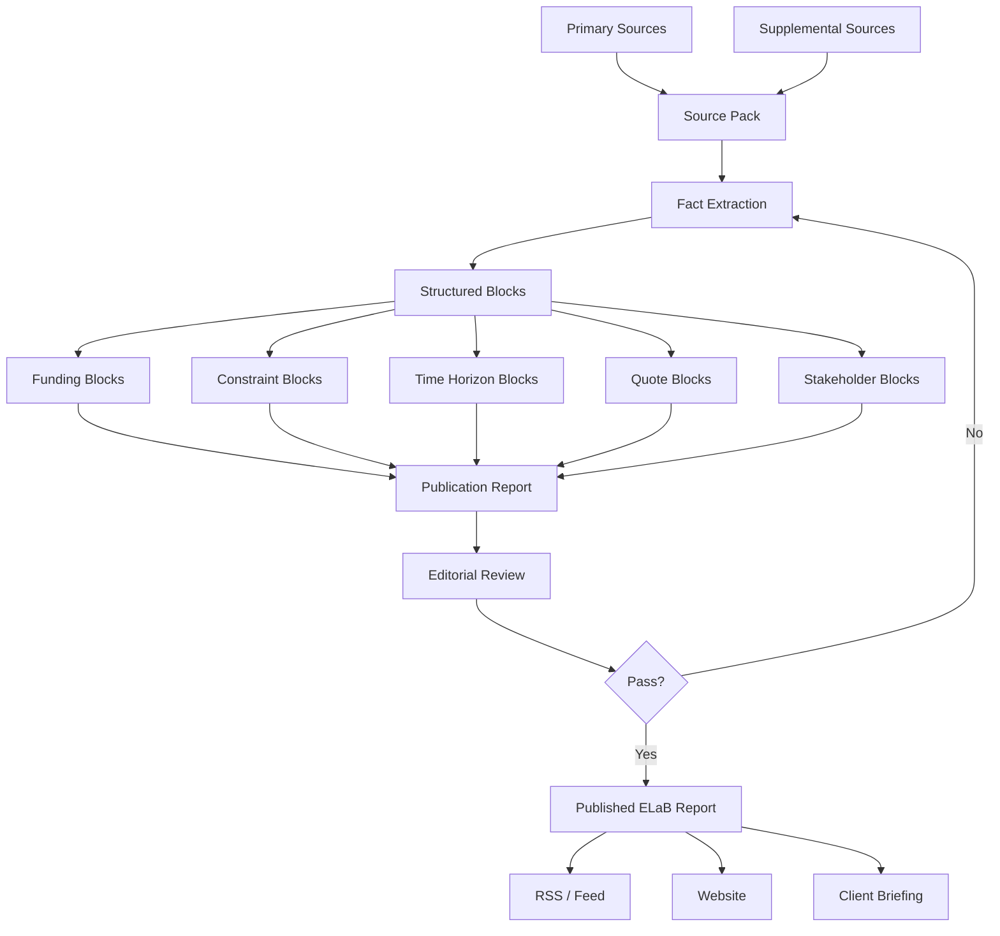
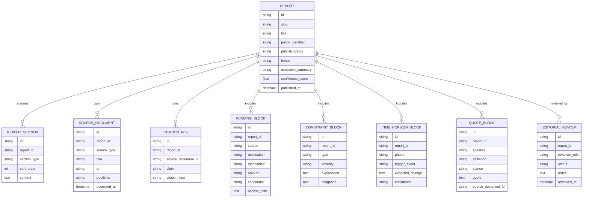
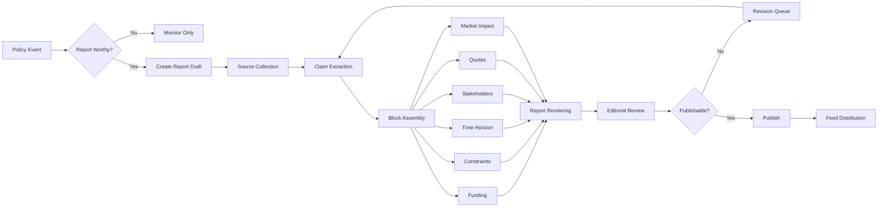
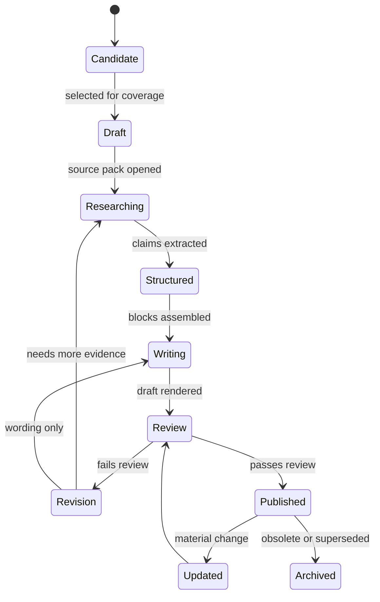
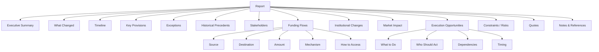
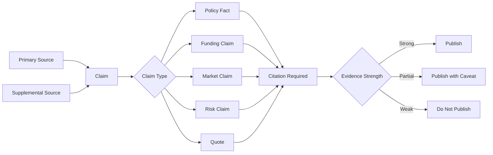
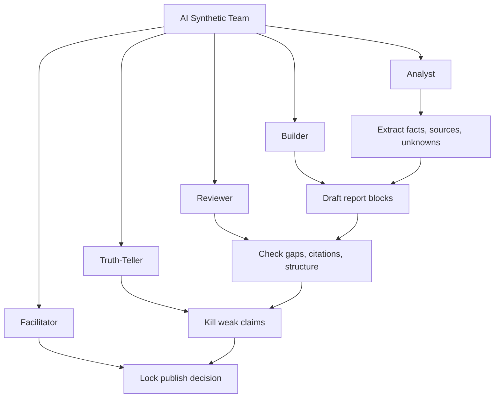
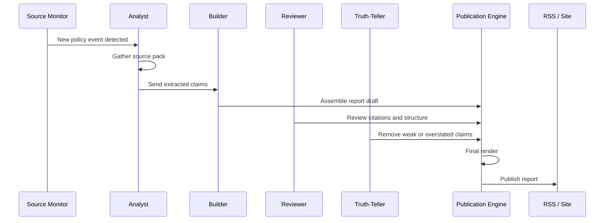
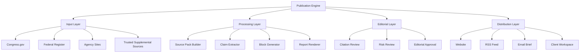

Yes. Update the model around **publication**, not normalized graph purity.

# ELaB Publication Engine Model

```yaml
PublicationReport:
  id:
  slug:
  title:
  subtitle:
  policy_subject:
    name:
    type: bill | law | executive_order | regulation | grant | agency_action
    identifier:
    status:
  publish_status:
    draft | review | published | archived
  audience:
    primary:
    secondary:
  thesis:
  executive_summary:
  report_sections:
    policy_summary:
    timeline:
    key_provisions:
    amendments:
    exceptions:
    historical_precedents:
    stakeholder_map:
    funding_flows:
    market_impact:
    institutional_changes:
    execution_opportunities:
    constraints:
    criticisms_risks:
    quotes:
    notes_references:
  source_pack:
    primary_sources: []
    supplemental_sources: []
    citation_quality:
      verified | partial | weak
  editorial_metadata:
    author:
    synthetic_team_roles_used: []
    confidence_score:
    last_fact_check:
    version:
```

# Simplified Supporting Blocks

## Funding Block

```yaml
FundingBlock:
  title:
  source:
  destination:
  mechanism:
  amount:
  confidence:
  access_path:
  why_it_matters:
  citation_refs: []
```

## Constraint Block

```yaml
ConstraintBlock:
  title:
  type:
  affected_parties:
  severity:
  explanation:
  workaround_or_mitigation:
  citation_refs: []
```

## Time Horizon Block

```yaml
TimeHorizonBlock:
  phase: immediate | near_term | long_term
  trigger_event:
  expected_change:
  action_window:
  confidence:
  watchlist_sources: []
```

## Quote Block

```yaml
QuoteBlock:
  speaker:
  affiliation:
  stance: neutral | promoter | detractor
  quote:
  source:
  citation_ref:
```

# Final Report Template

```markdown
# [Title]

## Executive Summary

## What Changed

## Timeline
- Introduced:
- Key Amendment:
- Enacted:

## Key Provisions

## Exceptions

## Historical Precedents

## Who Backed It / Opposed It
- Legislators:
- Lobbyists:
- Interest Groups:
- Promoters:
- Detractors:

## Funding Flows
- Source:
- Destination:
- Amount:
- Mechanism:
- How to Access:

## Institutional Changes Required

## Market Impact
- Industries directly benefiting:
- Companies likely benefiting:

## Execution Opportunities
- What to do:
- Who should act:
- Dependencies:
- Timing:

## Constraints, Criticisms & Risks

## Quotes
- Neutral:
- Promoters:
- Detractors:

## Notes & References
```

# Backend Tables for Publication Engine

```text
reports
report_sections
source_documents
citation_refs
funding_blocks
constraint_blocks
time_horizon_blocks
quote_blocks
editorial_reviews
```

# Rule Change

Old rule:

> Do not store opportunity directly.

New publication-engine rule:

> Store opportunity as an editorial claim, but require citation, confidence, and reasoning.

That gives you speed without turning ELaB into a sloppy newsletter.

# Product Definition

ELaB is:

> A structured policy intelligence publication engine that turns public institutional policy changes into readable, cited, market-relevant reports.

Not a raw policy database. Not Bloomberg. Not FiscalNote. Not a graph engine.

Build the reporting spine first. Later, extract graph objects from published reports.

# Diagrams

















