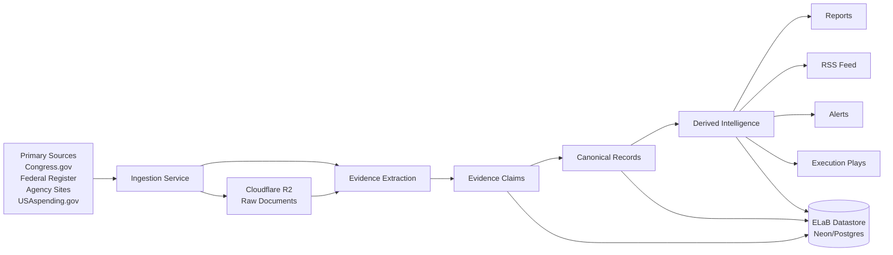
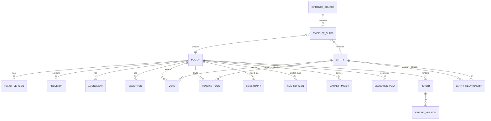
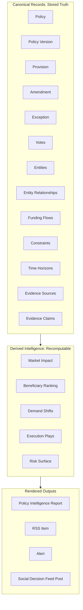
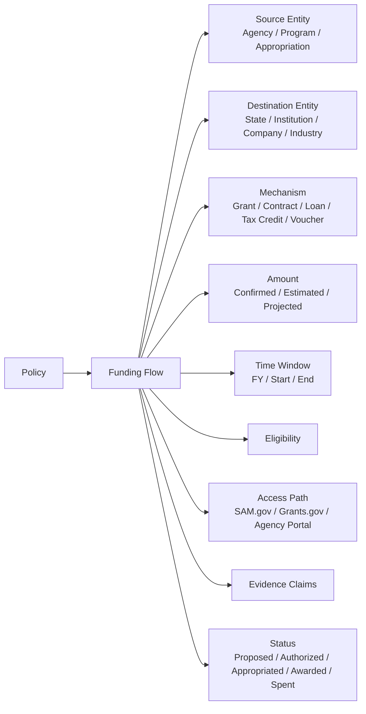
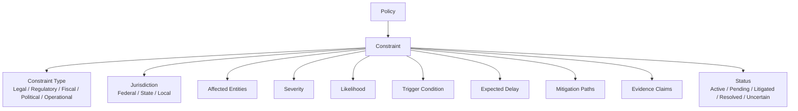
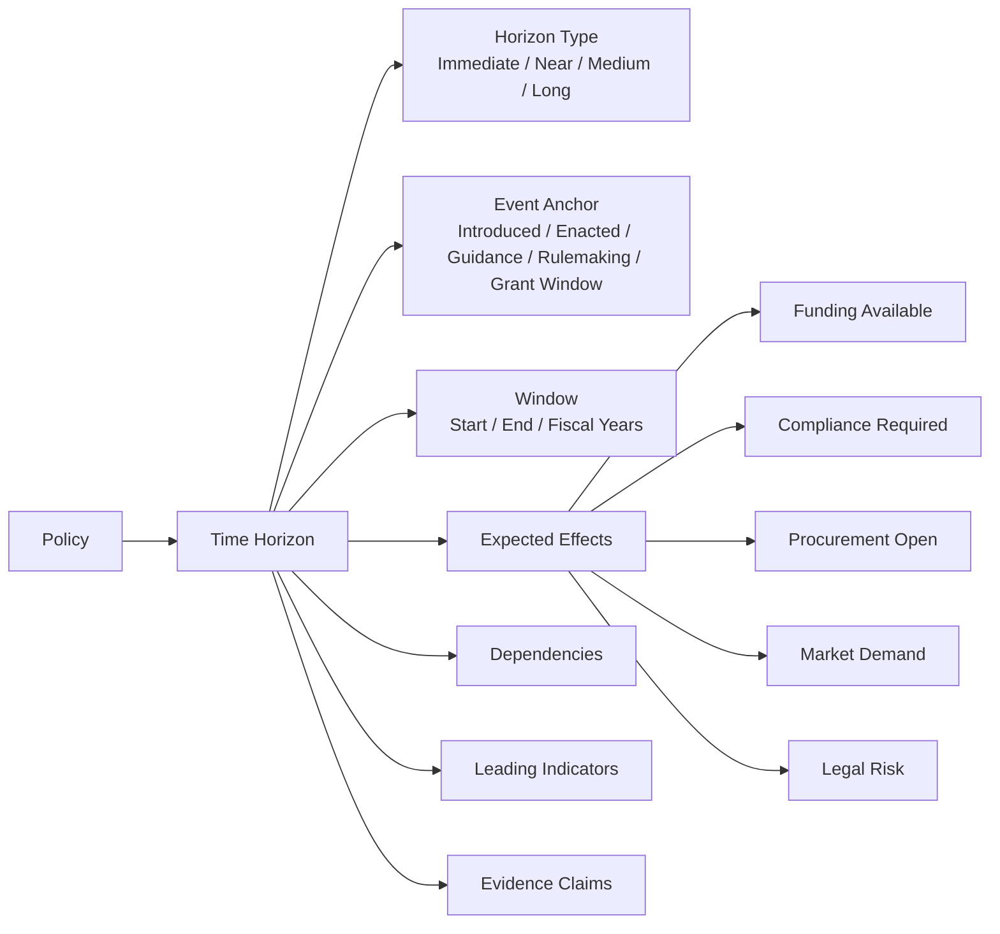
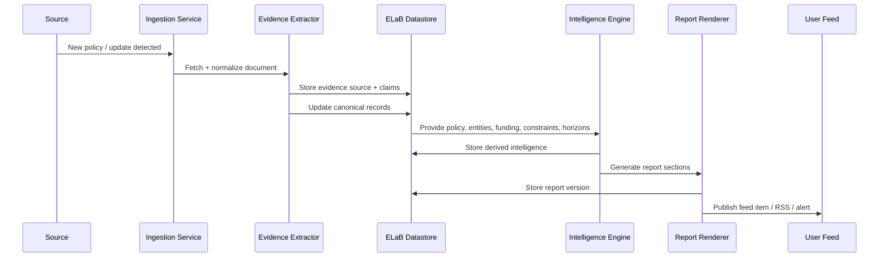
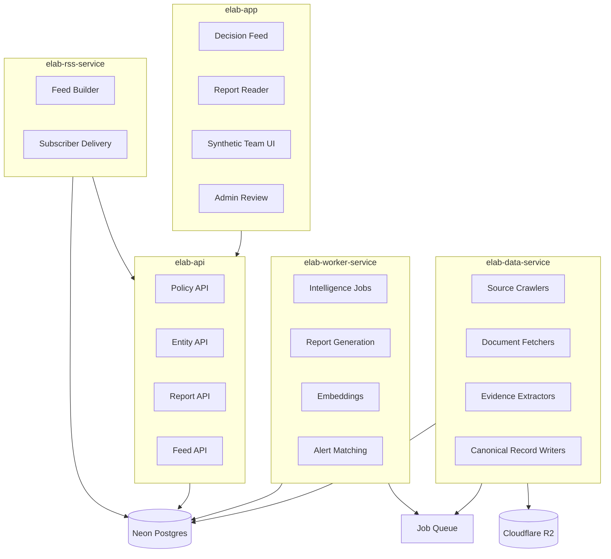
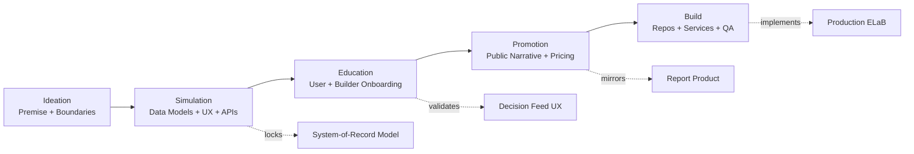

For **system-of-record**, update the model like this:

# ELaB System-of-Record Model

ELaB is no longer “report-first.” It is a **policy-to-market intelligence datastore** that can generate reports, feeds, alerts, and execution plays from structured facts.

Core rule:

> Reports are outputs. Records are the product.

This fits the original ELaB premise: convert live policy shifts into actionable market intelligence within 72 hours, using policy breakdowns, capital reallocation maps, beneficiary rankings, execution playbooks, and risk surfaces.

---

## 1. Canonical Objects

```yaml
Policy:
  id:
  source_system:
  source_url:
  external_identifier:
  type: bill | law | executive_order | regulation | grant | agency_guidance
  title:
  status:
  jurisdiction:
  introduced_at:
  enacted_at:
  effective_at:
  updated_at:
  sponsors: []
  provisions: []
  amendments: []
  exceptions: []
  votes: []
  agencies: []
  evidence_refs: []
```

```yaml
Provision:
  id:
  policy_id:
  section:
  text:
  normalized_summary:
  affected_entities: []
  obligations: []
  permissions: []
  prohibitions: []
  evidence_refs: []
```

```yaml
Entity:
  id:
  type: agency | legislator | company | industry | lobbyist | interest_group | nonprofit | school | contractor | program
  name:
  aliases: []
  identifiers:
    bioguide_id:
    fec_id:
    sam_uei:
    ticker:
    congress_id:
  evidence_refs: []
```

```yaml
EntityRelationship:
  id:
  source_entity_id:
  target_entity_id:
  relationship_type:
    sponsors | votes_for | votes_against | regulates | funds | lobbies_for | lobbies_against | benefits_from | constrained_by | competes_with
  policy_id:
  confidence:
  evidence_refs: []
  valid_from:
  valid_to:
```

---

## 2. Funding Flow Object

```yaml
FundingFlow:
  id:
  policy_id:
  source_entity_id:
  destination_entity_id:
  mechanism:
    type: grant | contract | loan | tax_credit | voucher | formula_funding | discretionary_award | reallocation | procurement
    program_name:
    authority:
  amount:
    value:
    range_min:
    range_max:
    currency: USD
    confidence: confirmed | estimated | projected | unknown
  fiscal_year:
  time_window:
    start_date:
    end_date:
  eligibility:
    eligible_entities: []
    requirements: []
    exclusions: []
  access_path:
    application_url:
    procurement_portal:
    registration_required:
    deadline:
  status:
    proposed | authorized | appropriated | obligated | awarded | spent | expired
  evidence_refs: []
```

Funding must remain structured because ELaB’s own system constraint says policy interpretation must map to observable funding shifts.

---

## 3. Constraint Object

```yaml
Constraint:
  id:
  policy_id:
  constraint_type:
    legal | regulatory | constitutional | procedural | procurement | fiscal | political | operational | market
  name:
  description:
  jurisdiction:
  affected_entities: []
  severity: low | medium | high | critical
  likelihood: low | medium | high | unknown
  trigger_condition:
  expected_delay:
  mitigation_paths: []
  status: active | pending | litigated | resolved | uncertain
  evidence_refs: []
```

---

## 4. Time Horizon Object

```yaml
TimeHorizon:
  id:
  policy_id:
  horizon_type: immediate | near_term | medium_term | long_term | unknown
  event_anchor:
    introduced | amended | enacted | rulemaking | guidance | appropriation | grant_window | enforcement | litigation | market_response
  start_date:
  end_date:
  fiscal_years: []
  expected_effects:
    - type: funding_available | compliance_required | procurement_open | market_demand | legal_risk | beneficiary_gain
      affected_entities: []
      confidence:
  dependencies: []
  leading_indicators: []
  status: projected | active | delayed | completed | blocked
  evidence_refs: []
```

---

## 5. Derived Objects — not source of truth

These are computed from canonical records.

```yaml
MarketImpact:
  id:
  policy_id:
  generated_at:
  sectors_affected: []
  capital_flows: []
  beneficiary_rankings: []
  demand_shifts: []
  risks: []
  input_records: []
  confidence:
```

```yaml
ExecutionPlay:
  id:
  policy_id:
  generated_at:
  action:
  target_entities: []
  required_conditions: []
  dependencies: []
  constraints: []
  funding_flows: []
  time_horizon:
  risk_level:
  evidence_refs: []
```

```yaml
Report:
  id:
  policy_id:
  generated_at:
  version:
  report_type:
  sections: []
  input_records: []
  citations: []
```

Your original fields — summary, analysis, industries benefiting, companies benefiting, risks, quotes — become **report sections or derived intelligence**, not canonical records. The uploaded model already points this direction: fields that can change without the policy changing do not belong in the core model.

---

## 6. Evidence Layer

This is mandatory.

```yaml
EvidenceSource:
  id:
  source_type: primary | supplemental | internal_analysis
  publisher:
  title:
  url:
  retrieved_at:
  published_at:
  document_hash:
  reliability_score:
```

```yaml
EvidenceClaim:
  id:
  evidence_source_id:
  claim_text:
  normalized_claim:
  claim_type:
    fact | quote | estimate | forecast | opinion | vote | funding | legal_text
  extracted_entity_ids: []
  policy_id:
  confidence:
```

No claim without evidence. No report without traceability.

---

## 7. Minimal Database Tables

```text
policies
policy_versions
provisions
amendments
exceptions
votes
entities
entity_relationships
funding_flows
constraints
time_horizons
evidence_sources
evidence_claims
market_impacts
execution_plays
reports
report_versions
```

---

## 8. Correct System Boundary

ELaB should store:

```text
policy facts
entity relationships
funding movement
constraints
time horizons
evidence claims
versions
```

ELaB should generate:

```text
summaries
analysis
beneficiary rankings
company benefit predictions
criticisms
quotes packages
execution plays
reports
RSS feed items
alerts
```

---

## Final correction

Your report generator can still exist. But it becomes a **renderer** sitting on top of the datastore.

Architecture:

```text
Primary Sources
  → Ingestion
  → Evidence Claims
  → Canonical Records
  → Derived Intelligence
  → Reports / RSS / Feed / Alerts
```

That is the system-of-record version.

---


Below are Mermaid diagrams for the **ELaB system-of-record** version.

---

## 1. System Architecture



---

## 2. Source-of-Truth Data Model



---

## 3. Canonical vs Derived Boundary



Hard boundary: **store facts; generate interpretation.**

---

## 4. Funding Flow Object



---

## 5. Constraint Object



---

## 6. Time Horizon Object



---

## 7. Report Generation Pipeline



---

## 8. ELaB Multi-Service Architecture



---

## 9. Social Decision Feed Model

```mermaid
flowchart TB
  P[Policy Update] --> I[Intelligence Engine]

  I --> A[Analyst Post<br/>What changed?]
  A --> B[Builder Post<br/>What can be built?]
  B --> R[Reviewer Post<br/>What breaks?]
  R --> O[Operator Post<br/>What actions now?]
  O --> T[Truth-Teller Post<br/>What is overstated?]

  T --> F[Threaded Decision Feed]

  U[User] --> F
  U --> M[@Mention Role]
  M --> A
  M --> B
  M --> R
  M --> O
  M --> T
```

This matches the synthetic-role constraint: one role, one pass, auditable output.

---

## 10. AiD Fit for ELaB



AiD requires simulation artifacts before build, with API/data models, unknowns, and behavior locked before implementation.